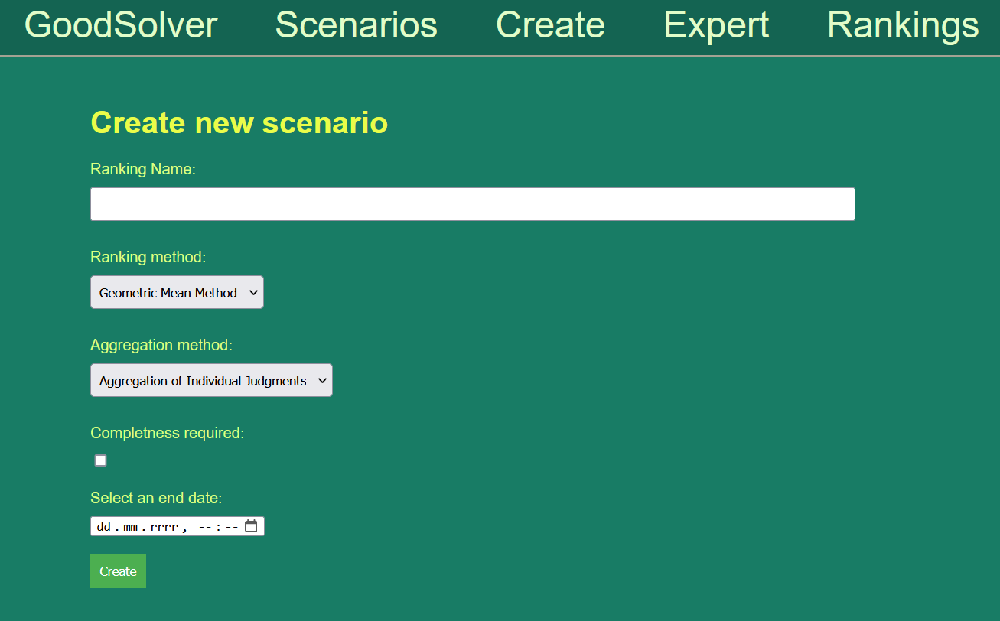
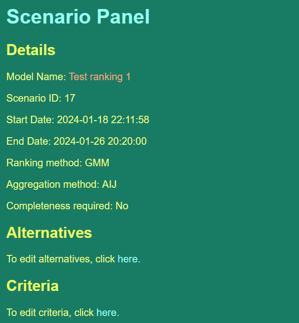
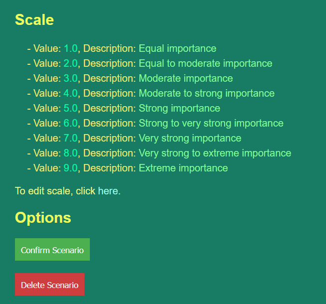
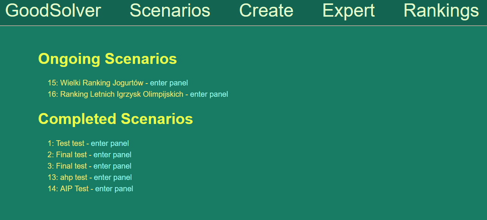
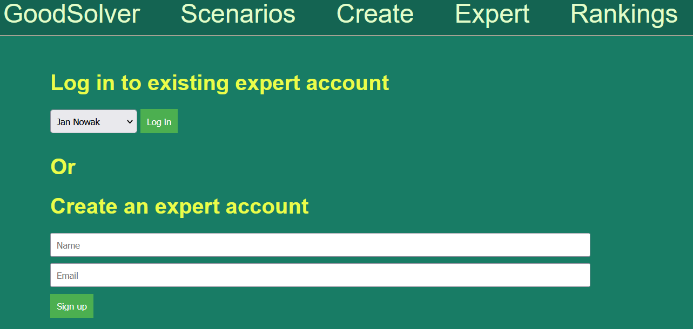
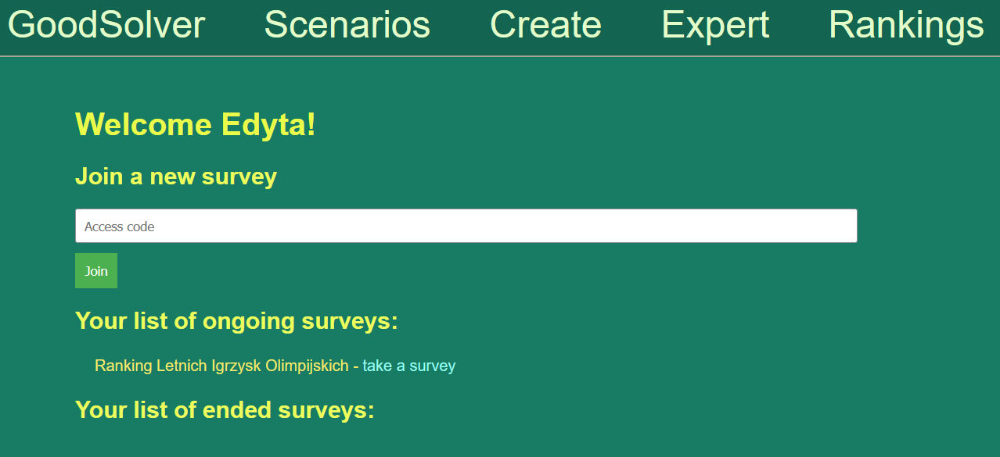
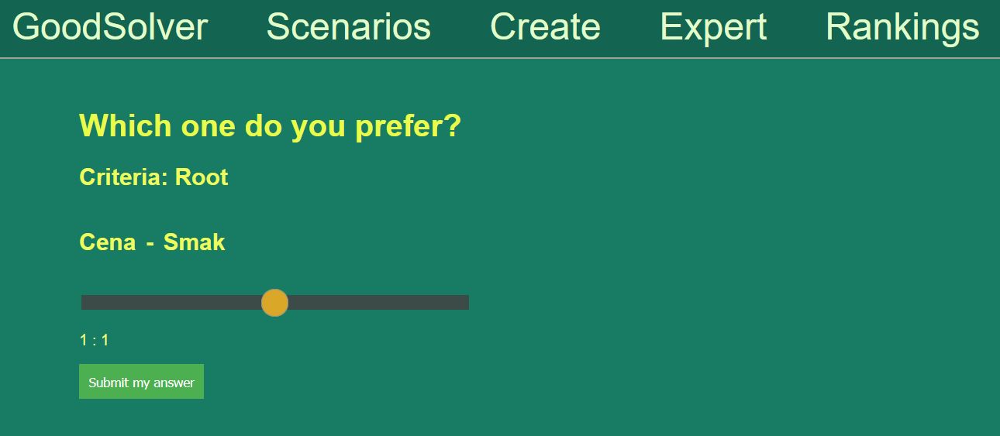
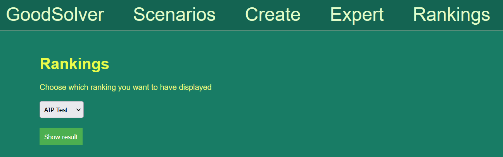

# Good Solver
Aplikacja internetowa pozwalająca na podejmowanie decyzji grupowych z wykorzystaniem metody **AHP**. Jest to projekt zaliczeniowy z przedmiotu *Metody i Algorytmy Podejmowania Decyzji*.

## Instalowanie wymaganych bibliotek
Aby zainstalować wymagane biblioteki należy wykonać polecenie:
```
    pip install -r requirements.txt
```

## Łączenie z bazą danych
Aplikacja wymaga połączenia z siecią AGH do komunikacji z bazą MySQL znajdującą się na serwerze `mysql.agh.edu.pl`.

W tym celu można skorzystać z VPN'a dostępnego dla studentów i pracowników uczelni AGH.

## Uruchomienie aplikacji
Aby uruchomić aplikację należy udać się do folderu [src](/src/), gdzie znajduje się plik [app.py](/src/app.py) i wykonać polecenie:
```
    flask run
```
Aplikacja będzie dostępna pod adresem: [http://127.0.0.1:5000](http://127.0.0.1:5000)

## Korzystanie z aplikacji
Ponieważ aplikacja jest również hostowana na platformie *Railway*, można z niej korzystać bez konieczności uruchamiania jej lokalnie.

Aplikacja jest dostępna pod adresem: [https://good-solver.up.railway.app/](https://good-solver.up.railway.app/)


## Przykład użycia aplikacji
Po przejściu na podstronę `Create` mamy szansę stworzyć nowy ranking. Można tutaj nazwać swój ranking, wybrać metodę tworzenia rankingu oraz jedną z dwóch metod agregacji. Jest też możliwość wybrania czy dane mają być kompletne oraz jaka ma być data i godzina zakończenia zbierania danych.



Po wprowadzeniu wszystkich danych zostajemy przekierowani na stronę z opisem danych związanych z rankingiem, gdzie możemy dodać alternatywy, kryteria (wraz z podkryteriami) oraz zmienić skale oceny. Po wypełnieniu możemy zatwierdzić ranking i zacząć dodawać ekspertów.




Również ze strony scenariuszy możemy przejść na podstronę danego rankingu.



Następnie możemy przejść na podstronę eksperta aby wypełnić ankietę. Możemy albo się zalogować albo stworzyć sobie konto jeśli jeszcze nie mamy.



Po zalogowaniu się możemy dodać się do dowolnego otwartego rankingu, wziąć udział w ankiecie lub zobaczyć wyniki z zamkniętego już rankingu.



Przechodzimy więc do wypełniania ankiety. Przesuwając suwakiem możemy określić jak bardzo preferujemy jedną rzecz od drugiej w kontekście danego kryterium. Oczywiście jeśli nie jesteśmy pewni co oznacza dana waga to możemy spowrotem przejść do podstrony danego rankingu i sprawdzić.



Gdy wszyscy eksperci wypełnili już ranking to możemy wrócić do podstrony rankingu i tam go zakończyć. Następnie możemy udać się na stronę rankingów, gdzie możemy już wybrać nasz ranking do wyświetlenia. Możemy także tam przejść bezpośrednio z podstrony danego rankingu.



Tam też możemy zobaczyć ostateczne wyniki oraz pobrać dane naszego modelu.
